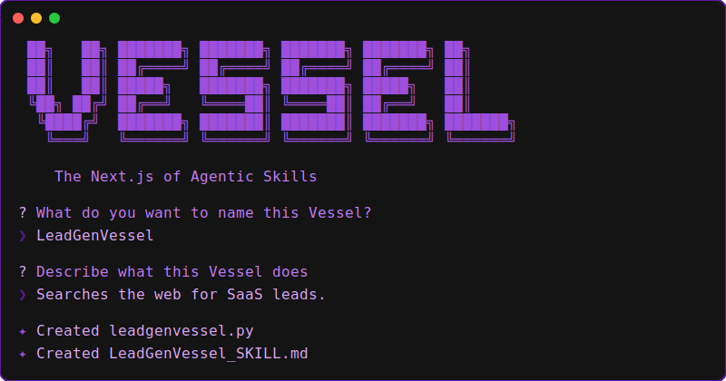

<div align="center">
  
# 🚢 Vessel
**The Next.js of Agentic Skills.**



*Stop trying to teach your AI Agent how to handle rate limits, network failures, and bad JSON. Give it a **Fat Skill** instead.*

</div>

---

## The Problem: "Skillification Exhaustion"

If you've built AI Agents, you know the pain:
1. You ask your Agent (OpenClaw, Claude, Hermes) to do something complex: *"Find SaaS leads and verify their emails."*
2. The Agent writes a Python script on the fly. It hits a rate limit (429). It crashes.
3. You prompt the Agent: *"If you hit a 429, wait 60 seconds."*
4. It tries again. It gets an unexpected JSON response. It crashes.
5. You prompt the Agent: *"Expect this exact JSON schema and ignore missing fields."*
6. Three days later, it finally works. You tell the Agent: **"SKILLIFY THIS."**
7. Next week, the API changes slightly. The prompt-based skill breaks. The cycle begins again.

LLMs are brilliant reasoning engines, but they are **terrible execution environments**.

## The Solution: "Thin Harness + Fat Skill"

**Vessel** is a framework that fundamentally changes how Agents interact with the real world. 

Instead of forcing the LLM to learn how to handle network blips, pagination, and data parsing through sheer trial and error, **Vessel pre-packages all of that resilience into deterministic, self-healing Python code.**

When an Agent uses a Vessel, it doesn't write code. It doesn't worry about failures. It just passes a strict JSON payload to the Vessel, and the Vessel guarantees a perfect, validated result back.

---

## ⚡️ For Beginners: Zero-Friction Creation

You don't need to be a Python expert to build 100% reliable tools.

1. **Run the Wizard:**
```bash
vessel create
```
The stunning, interactive CLI will ask you what you want to build.

2. **The Magic Output:**
Vessel instantly generates two files:
*   `leadgenvessel.py`: A robust, self-healing Python script (the "Fat Skill").
*   `LeadGenVessel_SKILL.md`: The exact instruction manual your Agent needs.

3. **Deploy to your Agent:**
Drag and drop those two files into your OpenClaw or Hermes workspace. The `.md` file tells the Agent exactly how to use the `.py` script via the terminal. **100% portable. Zero servers required.**

---

## 🛠 For Pro Devs: Absolute Control

Vessel exposes a powerful, heavily typed architecture for building enterprise-grade tools.

### 1. Strict I/O Validation (Pydantic)
If an API returns garbage, Pydantic catches it *inside the Vessel*. It raises a clear error instead of passing hallucinated data back to your LLM context.

### 2. Stateful Retries (Tenacity)
Network blips happen. Vessels automatically wrap your `execute()` method in exponential backoff retries. The Agent never even knows a failure occurred.

### 3. Circuit Breaking
If an API is hard-down (e.g., 3 consecutive run failures), Vessel trips a **Circuit Breaker**. It instantly rejects further requests for the next hour, saving your Agent from infinite retry loops and drained API credits.

### Example: Building a Vessel

```python
from pydantic import BaseModel
from vessel.core.base import BaseVessel

class WeatherInput(BaseModel):
    location: str

class WeatherOutput(BaseModel):
    temperature: float
    status: str

# BaseVessel handles Retries, Validation, and Circuit Breaking automatically!
class WeatherVessel(BaseVessel[WeatherInput, WeatherOutput]):
    """Fetches the current weather for a given location."""
    
    def execute(self, inputs: WeatherInput) -> WeatherOutput:
        # Your deterministic logic here. 
        # If this throws an exception, Vessel will automatically back off and retry.
        return WeatherOutput(temperature=72.5, status="Sunny")
```

---

## 🔌 The MCP Server (Optional)

Do you use Claude Desktop or an Agent that supports the **Model Context Protocol (MCP)**? 

Vessel has a built-in dynamic adapter. Point the Vessel server at your skills directory, and it will instantly translate your Pydantic schemas into native MCP Tools over `stdio`.

```bash
vessel serve ./my_skills_directory
```

---

## 📦 Installation

```bash
# Requires Python >= 3.11
pip install vessel
```
*(Or use `uv` for lightning-fast installation!)*

---

<div align="center">
  <i>Built for the next generation of autonomous systems.</i>
</div>
